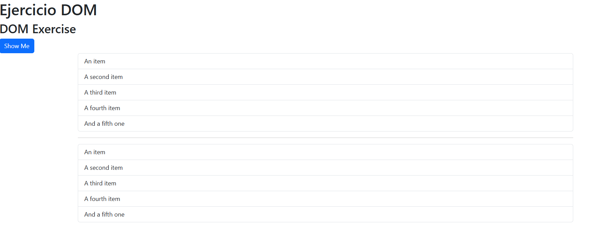

# EjercicioDOM

---

## Ejercicio Document Object Model (DOM)

Tareas para realizar:
1. Modificar la primera lista
2. Modificar la segunda lista
3. Probar los métodos de elementos (no HTML)

---

Código para actualizar el repositorio
```
git status
git add .
git commit -m "texto"
git push origin main
```
> Así es como queda el index de mi proyecto DOM

